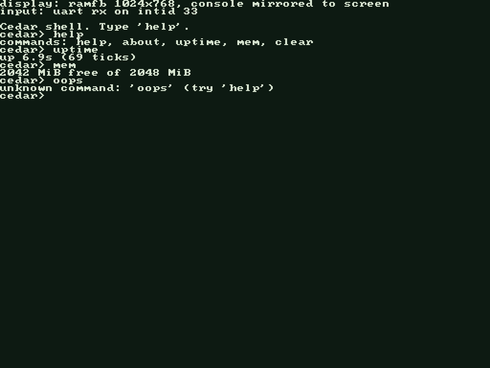

# Cedar



A hobby ARM (aarch64) operating system kernel written in Zig — with **no
bootloader**. The boot path belongs to the kernel: a raw image with a
Linux arm64 boot header is loaded directly by QEMU's `-kernel` (and, in
the future, by the Raspberry Pi firmware as `kernel8.img`), and every
instruction from the entry point on is Cedar's own code.

Cedar is **ARM-only by design**: the target hardware is Apple Silicon
(via QEMU/HVF) and, eventually, Raspberry Pi. There is no x86_64 support
and none is planned.

Current state (verified in QEMU): boots at EL1, brings the MMU up in
the boot stub and runs entirely in the **higher half** — the kernel is
linked at HHDM (`0xffffff8000000000`) + physical, TTBR0 walks are
disabled so null dereferences fault with a register dump. It installs
exception vectors, parses the device tree (machine model, RAM range,
PL011 discovery by `compatible`), and brings up a
bitmap frame allocator over all of RAM and a first kernel heap
(std.mem.Allocator-compatible). GICv2 and the virtual architectural
timer are driven from the device tree, and a round-robin scheduler
preempts kernel threads on every 10 Hz tick — each thread runs on its
own stack, can yield via `svc #0`, `sleep()` until a tick deadline, or
block on a counting semaphore, all without burning CPU. On top of that:
a ramfb framebuffer console (all kernel output mirrors to the screen),
keyboard input over the PL011 RX interrupt, an interactive shell, Cedar
FS (in-RAM, case-insensitive/case-preserving, /System /Programs /Home),
and **userspace**: `run /Programs/hello` loads a flat binary from the
FS into its own EL0 address space. Syscalls: write, sleep, exit, ticks,
and open/read/close over Cedar FS with per-process file descriptors.
A faulting process is killed with a diagnostic; the kernel survives,
and every frame the process owned returns to the allocator.

## Prerequisites

- [Zig](https://ziglang.org/download/) 0.16.0
- `qemu-system-aarch64`

## Building and running

```sh
zig build       # kernel ELF + raw boot image (zig-out/bin/cedar.img)
zig build run   # boot cedar.img in QEMU (serial output on stdio)
```

## Layout

- `src/boot.S` — entry point: arm64 boot header, core parking, page
  tables + MMU bring-up, jump to the higher half, BSS, stack
- `src/vectors.S`, `src/exceptions.zig` — VBAR_EL1 table, ESR decode, dump
- `src/dtb.zig` — flattened device tree parser (host-tested: `zig build test`)
- `src/mmu.zig` — HHDM constants, phys/virt conversion helpers
- `src/pmm.zig` — bitmap frame allocator (host-tested)
- `src/mem.zig`, `src/heap.zig` — RAM bookkeeping and the kernel heap
- `src/gic.zig`, `src/timer.zig` — GICv2 driver and the CNTV timer
- `src/sched.zig` — round-robin scheduler; context switch = frame swap
  on the exception return path; sleep/block/wake states
- `src/sync.zig` — counting semaphore over the scheduler's block/wake
- `src/main.zig` — kmain, panic handler, kprint/kprintf
- `src/arch/aarch64.zig` — PL011 UART at its physical address, wfi halt
- `src/fwcfg.zig`, `src/ramfb.zig` — QEMU fw_cfg channel and the ramfb
  display it configures
- `src/console.zig`, `src/font8x8.zig` — framebuffer text console
- `src/input.zig`, `src/shell.zig` — UART RX ring + the `cedar>` shell
- `src/fs.zig` — Cedar FS, the in-RAM tree (host-tested)
- `src/user.zig`, `src/syscall.zig` — EL0 address spaces and syscalls
- `userland/` — user programs, built as flat binaries by the same build
- `linker-aarch64.ld` — `.boot` at physical 0x40080000, the rest at
  HHDM + physical with matching load addresses for the flat image

## Roadmap

Exception vectors (VBAR_EL1) → device tree parsing → own MMU/page tables
→ framebuffer driver (ramfb/mailbox) → timer + scheduler → Raspberry Pi
board support.
