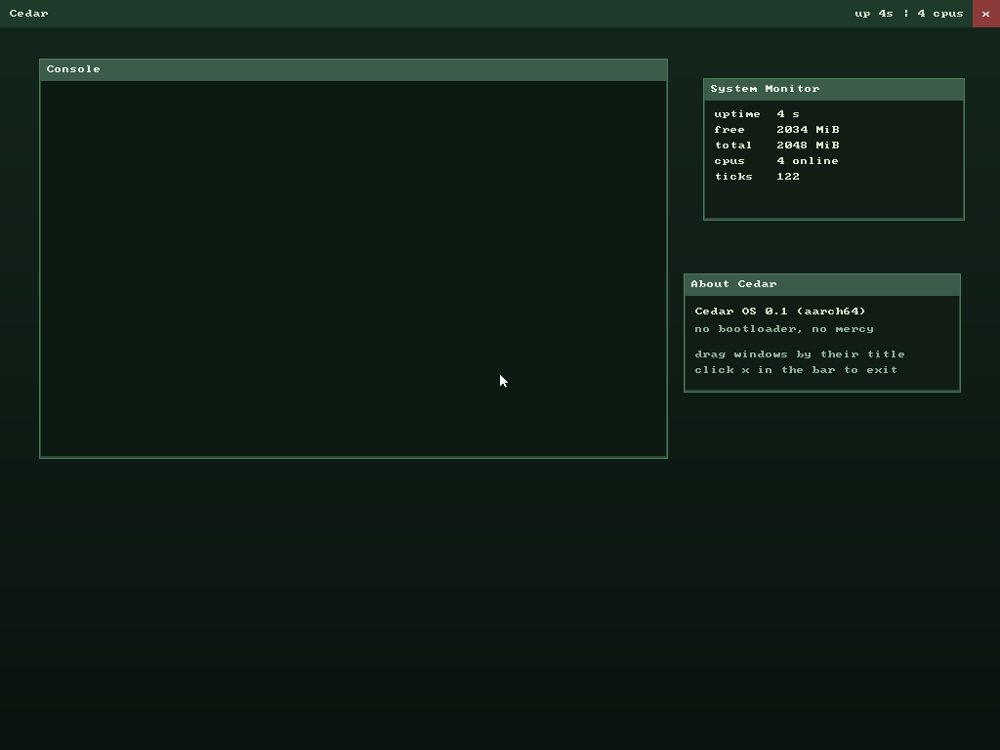

# 🌲 Cedar

> A modern, monolithic operating system written from scratch in **Zig** for the **ARM64 (AArch64)** architecture.

Cedar is a hobby operating system focused on clarity, reliability, and learning. It is built from the ground up without relying on existing kernels — or even a bootloader — featuring strict memory isolation, a preemptive scheduler, a custom filesystem, and an isolated EL0 userspace runtime.

---

# 🚀 Key Features

## 🏗️ Boot & Kernel Space (EL1)

- **No Bootloader**
  - The kernel is a raw image with a Linux arm64 boot header, loaded directly by QEMU's `-kernel`.
  - Every instruction from `_start` on is Cedar's own code: page tables and the MMU are brought up in the boot stub itself.

- **Higher-Half Kernel**
  - Runs at **Exception Level 1 (EL1)**, linked into the Higher-Half Direct Mapping region:
    ```
    0xffffff8000000000 + physical
    ```

- **Strict NULL Pointer Protection**
  - Address zero is never mapped — neither for the kernel nor for processes.
  - Any null-pointer dereference immediately generates a hardware exception with a full CPU register dump instead of silently corrupting memory.

- **Hardware Discovery**
  - Parses the Device Tree (DTB) during boot.
  - Detects:
    - machine model
    - available physical RAM
    - PL011 UART, GICv2, virtio and fw_cfg devices using compatible strings

---

## ⏱️ Scheduling & Synchronization

### Preemptive Scheduler

- Round-Robin scheduler
- Driven by:
  - GICv2 interrupt controller
  - ARM Generic Virtual Timer
- Tick frequency:
  ```
  25 Hz
  ```
  (smooth enough to drive the GUI cursor)

### SMP (multi-core)

- All cores are brought online via PSCI (`CPU_ON` over HVC); each runs
  its own idle thread, virtual timer and GIC CPU interface.
- One shared thread table under a spinlock; threads are assigned to
  cores round-robin and never migrate, so no cross-core stack hazard.
- The `spin` shell command spreads workers across the cores and each
  reports which one it ran on.

### Thread Isolation

- Every kernel thread has its own stack.
- Every userspace process has its own isolated user stack *and* kernel stack.

### Synchronization

Supports:

- `yield()` (`svc #0`)
- deadline-based `sleep()`
- blocking counting semaphores

Threads sleep instead of busy-waiting, avoiding unnecessary CPU usage.

---

## 💾 Memory Management & Cedar FS

### Physical Memory

Two-level memory management:

- bitmap page-frame allocator
- `std.mem.Allocator` compatible kernel heap

### Cedar FS

An in-memory filesystem with:

- case-insensitive lookup
- case-preserving names (macOS-style)
- created/modified timestamps on every node

Default layout:

```
/
├── System
├── Programs
└── Home
```

### Persistent Storage

Backed by a custom **VirtIO Block Driver**.

The entire filesystem tree can be snapshotted:

```text
save
```

Snapshots are written to the virtual disk image and automatically restored during boot. The snapshot header is committed last, so a crash mid-save never destroys the previous snapshot. `/System` and `/Programs` are always refreshed from the running kernel.

---

## 🖥️ Console, Keyboard & Shell

- **Framebuffer console**: a ramfb display (1024×768) configured through QEMU's fw_cfg channel; every line of kernel output is mirrored to the screen with a built-in bitmap font.
- **Input**: two paths feed the same ring buffer, so typing in the QEMU window and typing over serial are indistinguishable to the shell:
  - PL011 UART receive interrupts (serial).
  - virtio-input keyboard, claimed by name and translated through a US keymap.
- **Interactive shell** at the `cedar>` prompt:
  - system: `help`, `about`, `uptime`, `mem`, `clear`, `ps`, `smp`, `spin`, `save`, `gui`
  - files: `ls`, `cat`, `write`, `mkdir`, `rm`
  - processes: `run <path> [args...]`

---

## 🪟 Graphical Mode

Typing `gui` hands the screen to a window-manager kernel thread that
composes a full scene into a back buffer at 25 Hz:

- a desktop gradient, draggable windows with title bars and a close box,
  a top bar with a live clock and CPU count, and a mouse cursor;
- the kernel console is redirected into a **Console** window, so
  `kprint` and the shell keep working inside the GUI;
- a **System Monitor** window shows live uptime, free/total memory and
  online CPU count;
- input comes from a **virtio-tablet** pointer (absolute coordinates
  plus the left button), polled every frame.

Clicking the close box restores the full-screen console. All drawing is
done in software over 32-bpp linear surfaces shared by the screen, the
back buffer, and each window.

---

## 🌐 Networking

A small IPv4 stack over a **virtio-net** driver (two virtqueues, MAC
read from config space):

- **Ethernet + ARP**: resolves a neighbour's MAC and answers incoming
  ARP requests for our address;
- **IPv4 + ICMP**: sends echo requests and replies to incoming echoes;
- the internet checksum and all packet building/parsing are pure logic,
  unit-tested on the host.

Against QEMU's user-mode (SLIRP) network — our IP `10.0.2.15`, gateway
`10.0.2.2` — `ping` resolves the gateway and reports a round-trip:

```text
cedar> ping
ping 10.0.2.2: reply in 0.768 ms
cedar> net
mac      52:54:00:12:34:56
ip       10.0.2.15/24
gateway  10.0.2.2
gw mac   52:55:0a:00:02:02 (resolved)
```

QEMU's legacy `virtio-net-device` delivers received frames to the used
ring reliably but does not raise the RX interrupt here, so the driver
polls the ring (a low-frequency kernel thread keeps it drained so
incoming requests are answered even while idle).

---

## 👤 Userspace Runtime (EL0)

### Process Isolation

Every userspace process executes in its own hardware-isolated EL0 address space (per-process TTBR0 page tables).

### Program Execution

Programs are **ELF64 executables** loaded from the filesystem: the
kernel parses their program headers and maps each `PT_LOAD` segment
with its own permissions (R / W / X), then jumps to the ELF entry
point. Arguments are passed System V style.

Example:

```bash
run /Programs/cat /Home/note.txt
```

Arguments are placed on the userspace stack and delivered through:

- `x0` → `argc`
- `x1` → `argv`

### System Calls

Current syscall set includes:

- `write`
- `sleep`
- `exit`
- `ticks`
- `open`
- `read`
- `close`

Each process owns its own file descriptor table.

### Fault Recovery

If a userspace process crashes:

- a diagnostic (exception class, ELR, FAR) is printed
- the process is terminated
- all owned memory pages are reclaimed automatically

Kernel execution continues normally.

---

# 🛠️ Tech Stack

| Component | Technology |
|-----------|------------|
| Language | Zig 0.16.0 |
| Architecture | ARM64 (AArch64) |
| Bootloader | None — direct kernel image |
| Emulator | QEMU (`-M virt`) |
| Interrupt Controller | GICv2 |
| UART | PL011 |
| Display | ramfb via fw_cfg |
| Input | virtio-input (keyboard + tablet), PL011 serial |
| Graphics | software-rendered window manager |
| Storage | VirtIO Block |
| Networking | VirtIO Net + IPv4/ARP/ICMP stack |

---

# 📸 Demo




Example session:

```text
cedar> ls
     dir  System/  (1 items)
     dir  Programs/  (4 items)
     dir  Home/  (1 items)

cedar> write /Home/note.txt Hello from Cedar OS!
20 bytes -> /Home/note.txt

cedar> run /Programs/cat /Home/note.txt
Hello from Cedar!
sched: 'cat' exited (code 0)

cedar> save
fs: snapshot saved, 1893 bytes
```

---

# 🚀 Quick Start

Prerequisites: [Zig 0.16.0](https://ziglang.org/download/) and QEMU (`qemu-system-aarch64`).

Clone the repository:

```bash
git clone https://github.com/NaumRedlo/Cedar.git
cd Cedar
```

Build and launch immediately:

```bash
zig build run
```

A QEMU window opens with the Cedar screen. Type directly in that window (virtio keyboard) or in the terminal you launched from (serial) — both reach the shell. Try `gui` for the graphical mode. A 16 MiB `disk.img` for snapshots is created automatically on first run.

Run the host-side unit tests (FS, DTB parser, frame allocator):

```bash
zig build test
```

---

# 🌱 Project Goals

Cedar is an educational and experimental operating system focused on building a clean architecture from first principles.

Current goals include:

- robust virtual memory
- multitasking
- isolated userspace
- persistent filesystem
- simple and understandable kernel architecture

Future plans may include:

- networking
- a richer window manager and desktop environment
